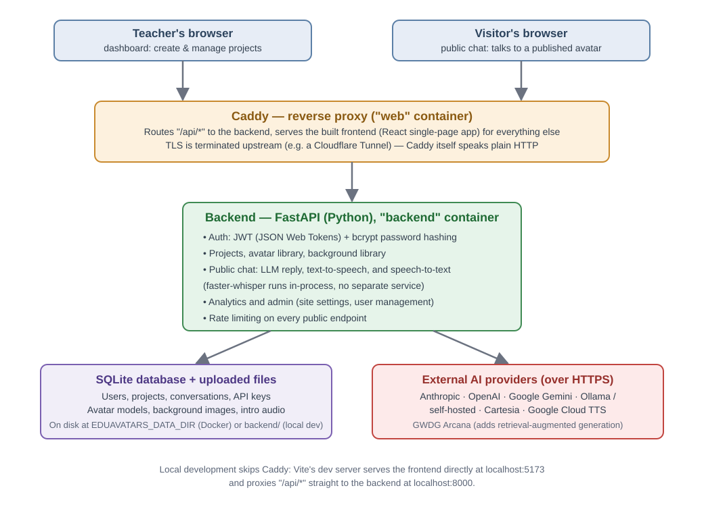

# EduAvatars

**Create a talking 3D avatar, give it a personality, and share it as a link — no coding
required to use it, once someone has set it up for you.**

EduAvatars is a web app for building custom AI characters that students, visitors, or
colleagues can talk to in a browser, by typing or by speaking out loud. A teacher (or anyone
with an account) creates a "project": a persona described in plain language, backed by an AI
language model, with a 3D face and a voice. Publishing a project turns it into a public link —
visitors need no account and no technical knowledge to use it.

<p align="center">
  
</p>

## Who is this for?

- **Teachers and instructors** — build a subject-matter tutor, an exam-prep quiz partner, a
  historical figure students can interview, or an always-available FAQ desk for your course.
  See [Using EduAvatars as a teacher](#using-eduavatars-as-a-teacher) below — no installation
  needed if your institution already runs an instance.
- **Researchers and institutions** — self-host to keep full control over student data, export
  anonymized conversation logs for study, and compare answer quality/latency/cost across
  several AI providers side by side. See [Using EduAvatars as a researcher](#using-eduavatars-as-a-researcher).
- **Developers and IT admins** — a small, self-contained FastAPI + React stack you can run
  locally in minutes or deploy with Docker. See [Deployment](#deployment).

## What you can do

- **Give an avatar a personality.** Describe how it should behave in plain language (a system
  prompt) — e.g. "You are a patient calculus tutor who never gives away the final answer
  directly."
- **Pick a 3D face and a voice.** Every project starts with two bundled 3D faces to choose from
  (Julia and David), or upload your own; add a background image if you like; pick a synthesized
  voice from any connected provider.
- **Talk by typing or by speaking.** Visitors can type a message or hold a button to speak —
  their speech is transcribed automatically, and the avatar answers out loud with matching lip
  movement.
- **Share one link, nothing to install.** A published project gets a public chat URL. Visitors
  need no account, no API key, and no software.
- **Protect access if needed.** Optionally require a password before the chat starts, or ask
  visitors to type a name/ID first so their sessions are easy to tell apart afterwards.
- **Bring your own AI provider key.** Connect Anthropic, OpenAI, Google Gemini, Mistral,
  Cartesia, Google Cloud TTS (text-to-speech), a self-hosted/Ollama model, an OpenAI-compatible
  endpoint, or GWDG Arcana (which adds RAG — retrieval-augmented generation — so answers can be
  grounded in your own uploaded documents). See [Supported AI providers](#supported-ai-providers).
- **Review usage afterwards.** A built-in analytics dashboard shows session counts, message
  volume, and per-conversation transcripts, exportable as CSV/ZIP.
- **Use it in English or German.** The dashboard and public chat UI (user interface) are fully
  translated into both.

<p align="center">
  
</p>

## Using EduAvatars as a teacher

If someone else (your IT department, your institution) already runs an EduAvatars instance for
you, none of the setup below applies — just:

1. **Log in** (or register, if open registration is enabled) at your instance's web address.
2. **Create a project** from the dashboard: give it a name, pick an avatar and a background
   image.
3. **Connect an AI provider**, or ask your admin whether one is already available for everyone
   to use. This is the "brain" that generates the avatar's replies.
4. **Describe the avatar's personality** — a short instruction in plain language for how it
   should behave and what it should know or avoid.
5. **Preview it** — chat with your own avatar right in the wizard before anyone else sees it.
6. **Publish** — you get a shareable link. Optionally add a password, or require visitors to
   enter their name first. Publishing always saves your latest changes first, so there's no
   separate "save, then publish" step to remember.
7. **Check back later** under Analytics to see how many people talked to it and read through
   individual conversations.

## Using EduAvatars as a researcher

- **Self-host for data control.** Running your own instance (see [Deployment](#deployment))
  means conversation data never leaves infrastructure you control — relevant if you're working
  with student data under institutional data-protection rules.
- **Export conversation data.** The Analytics dashboard exports individual sessions or a bulk
  ZIP of everything for offline analysis.
  <p align="center">
    
  </p>
- **Compare AI providers.** Because API keys are bring-your-own and swappable per project, you
  can run the same persona against different LLMs (large language models) or voices and compare
  cost, latency, or answer quality.
- **Ground answers in your own material.** The GWDG Arcana provider adds RAG (retrieval-
  augmented generation): the avatar's answers are grounded in a knowledge base you supply,
  instead of relying purely on the model's built-in training.
- **Measure latency.** Every response is timed server-side (LLM, TTS, STT stage-by-stage) and
  the frontend can log matching client-side timings — see
  [backend/README.md](backend/README.md#latency-monitoring) — useful if you're studying
  response-time perception or comparing infrastructure choices.

## Project status

EduAvatars is under active development. The core flow — create a project, publish it, chat by
text or voice, view analytics — works end to end and is what this repo's default configuration
is built around. Automated test coverage is still thin (see
[backend/README.md](backend/README.md#tests)), and some rougher edges (error messages, mobile
layout, provider coverage) are still being smoothed out. Expect it to keep evolving.

Backend tests run in CI on every tagged release, and Docker images are only published if they
(and the frontend build) pass — see [`.github/workflows/docker-publish.yml`](.github/workflows/docker-publish.yml).
There's no CI gate on regular pull requests yet, only on the tag/publish step.

## Architecture

The app is split into two independent apps plus a deployment folder:

| Part | What it is | Docs |
|---|---|---|
| [`backend/`](backend/) | FastAPI (Python) API: auth, projects, LLM/TTS/STT calls, analytics | [backend/README.md](backend/README.md) |
| [`frontend/`](frontend/) | React + TypeScript single-page app, 3D avatar rendering with three.js enabled by [TalkingHead](https://github.com/met4citizen/TalkingHead) by Mika Suominen | [frontend/README.md](frontend/README.md) |
| [`docker/`](docker/) | Docker images, Compose file, and reverse-proxy config for deployment | [docker/README.md](docker/README.md) |

The frontend talks to the backend over HTTP. In production, Caddy (in `docker/`) reverse-proxies
both behind a single domain.

<p align="center">
  
</p>

## Deployment

There are two ways to run EduAvatars: locally for development (Deploy A), or with Docker for a
real deployment (Deploy B). Both read the same `.env` file at the repo root, so it only needs to
be set up once.

### Create the `.env` file

```bash
cp .env.example .env
```
Fill in the two required secrets (no default):

| Variable | Purpose |
|---|---|
| `JWT_SECRET` | Signs login tokens (JWT = JSON Web Token). Generate with `python3 -c "import secrets; print(secrets.token_urlsafe(48))"` |
| `API_KEY_ENCRYPTION_SECRET` | Encrypts stored provider API keys. Generate with `python3 -c "from cryptography.fernet import Fernet; print(Fernet.generate_key().decode())"` |

Both are validated at startup, not just required to be present: the app refuses to boot if either
is left at a placeholder value (e.g. `change-me`), too short, or — for `API_KEY_ENCRYPTION_SECRET`
— not actually a valid Fernet key, with an error telling you which one and how to generate a good
one. This catches a copy-pasted `.env.example` before it ever reaches production, not after.

`.env.example` has a comment on every other variable explaining which deploy path (A, B, or both)
uses it — see that file for the full list (SMTP, `SITE_ADDRESS`, `EDUAVATARS_DATA_DIR`, ...).

### Deploy A: local development

Run the backend and frontend directly on your machine — no Docker needed.

**1. Backend** (full details: [backend/README.md](backend/README.md))
```bash
cd backend
python3 -m venv .venv
source .venv/bin/activate
pip install -e .
python -m alembic upgrade head
uvicorn app.main:app --reload
```
The API is now available at `http://localhost:8000` (health check: `GET /health`).

To get your first admin account (dashboard access to manage other accounts, site settings, ...),
either set `ADMIN_EMAIL`/`ADMIN_PASSWORD` in `.env` and run
`python -m app.cli.bootstrap_admin` from `backend/` (same idempotent step Deploy B runs
automatically on every container start), or promote an existing account by hand in the database.

**2. Frontend** (full details: [frontend/README.md](frontend/README.md))
```bash
cd frontend
npm install
npm run dev
```
The app is now available at `http://localhost:5173` and proxies `/api/*` requests to the backend.

### Deploy B: Docker (production)

Runs both apps as containers behind a Caddy reverse proxy — the setup used for real deployments
(built for TrueNAS SCALE, but works on any Docker host). Full details, including the systemd
unit: [docker/README.md](docker/README.md).

```bash
docker compose -f docker/docker-compose.yml --env-file .env up -d
```
The example `docker-compose.yml` pulls prebuilt images (`chsiegel/eduavatars:frontend`/`:backend`) rather than building them — Caddy serves the frontend and reverse-proxies `/api/*` to the backend. TLS is expected to be terminated upstream (e.g. a Cloudflare Tunnel). The `web` service listens on port `30080` by default.

## Supported AI providers

Every project picks its own LLM (large language model, for generating replies) and, optionally,
its own TTS (text-to-speech) voice — each user connects these with their own API key under
"API Keys" in the dashboard. STT (speech-to-text, for voice input) is handled instance-wide by a
bundled offline model, so it needs no key from anyone.

| Provider | Used for | Notes |
|---|---|---|
| Anthropic | LLM | Claude models |
| OpenAI | LLM + TTS | GPT models for chat, `tts-1` for voices |
| Google Gemini | LLM + TTS | |
| Mistral | LLM | |
| Ollama | LLM | Self-hosted, e.g. on your own GPU server |
| OpenAI-compatible endpoint | LLM | Any self-hosted or third-party API that mimics OpenAI's (Together.ai, Groq, ...) |
| Cartesia | TTS | |
| Google Cloud TTS | TTS | The classic per-character Cloud TTS product, not Gemini's built-in voice |
| GWDG Arcana | LLM | German academic cloud provider; adds RAG (retrieval-augmented generation) against a knowledge base you configure there |

Adding a new provider is a matter of one entry in
[`backend/app/core/providers.py`](backend/app/core/providers.py) — the frontend's provider list
and validation are generated from that single source, so nothing else needs to change.

For Ollama and OpenAI-compatible keys, the endpoint address you enter can be anything on your own
network (e.g. a school's LAN GPU box) — the backend only rejects addresses that could never be a
real LLM/TTS server, like a cloud metadata endpoint, to close off that one otherwise-easy misuse of
a "bring your own endpoint" field.

## Tech stack

| Layer | Technology |
|---|---|
| Backend framework | FastAPI |
| Database | SQLite via SQLModel/SQLAlchemy, migrations with Alembic |
| Auth | JWT (JSON Web Tokens) + bcrypt password hashing |
| LLM / TTS providers | [litellm](https://github.com/BerriAI/litellm) (provider-agnostic client) |
| Speech-to-text | [faster-whisper](https://github.com/SYSTRAN/faster-whisper), runs in the backend process |
| Frontend framework | React 18 + TypeScript, built with Vite |
| 3D avatar rendering | three.js + [@met4citizen/talkinghead](https://github.com/met4citizen/TalkingHead) |
| Frontend data fetching | TanStack Query |
| Deployment | Docker Compose + Caddy, built by default for TrueNAS SCALE, but PUID/GID can be changed in `.env` file |

## 3D avatars and lip-sync

The avatar rendering and lip-sync are built on two MIT-licensed libraries by the same author
(Mika Suominen):

- **[TalkingHead](https://github.com/met4citizen/TalkingHead)** (npm: `@met4citizen/talkinghead`)
  — renders and animates the 3D avatar (see `frontend/src/components/TalkingHeadAvatar/`). Two
  models, Julia and David, ship under `frontend/public/avatars/` and are offered as defaults in
  every project's configurator — see that folder's `ATTRIBUTION.md` for license and details. Its
  repo's README documents how to create or prepare new avatar models compatible with the
  renderer — check that if you want to add avatars beyond the ones bundled here.
- **[HeadAudio](https://github.com/met4citizen/HeadAudio)** — computes lip-sync visemes directly
  from the played audio signal in real time, instead of text-based timing estimation. No npm
  package; vendored into `frontend/public/headaudio/` (see that folder's `ATTRIBUTION.md` for
  license and details).

## Data privacy note

EduAvatars itself does not phone home or share data with its developers. User accounts,
project settings, and conversation records stay on whichever server you (or your institution)
deploy the app to — see [Deploy B](#deploy-b-docker-production) for running your own instance.

This does **not** mean conversations stay fully private: every chat message (and, for voice
input, the audio) is sent to whichever third-party AI provider that project is configured to
use — see [Supported AI providers](#supported-ai-providers) — since that's what generates the
avatar's replies. That provider's own data-handling terms apply to that traffic, independent of
where you host EduAvatars itself. Password-reset emails (only if you configure SMTP) are the
only other outbound traffic the backend generates on its own.

Whether a given deployment and provider choice satisfies your institution's data-protection
requirements (e.g. GDPR — General Data Protection Regulation) is something you need to assess
yourself; this project does not provide a data-processing agreement or legal review on your
behalf.

If an admin sets a conversation retention period (Admin → Settings), it's enforced continuously
for as long as the backend process runs — re-checked every few hours, not just once when the
container happens to restart — so data past that limit doesn't linger indefinitely on a
long-uptime deployment.

## Contributing

Issues and pull requests are welcome. There's no formal contribution process yet — open an issue
to discuss a change before investing time in a large one.

## License

MIT — see [LICENSE](LICENSE).
